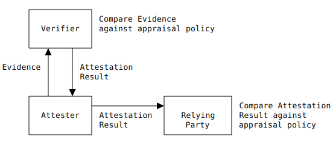

# RATS Cheat Sheet

## Architecture at a Glance

(This is a verbatim copy of [Figure 1](https://www.ietf.org/archive/id/draft-ietf-rats-architecture-14.html#figure-1) from the RATS architecture document.)

## Objectives and Mechanisms

The objective of the RATS architecture is to determine whether an [Attester](#attester) can be trusted by a [Relying Party](#rp) given the ability of the Attester to produce [Evidence](#evidence) about its *current* state.

The objective is achieved by a two-stage appraisal process mediated by a trusted third party, called [Verifier](#verifier), with trusted links to the supply chain.

The two stages are as follows:

1. <a name="evidence-appraisal">**Evidence Appraisal**</a> is the evaluation of the trustworthiness of [Evidence](#evidence) coming from an [Attester](#attester).  It takes Evidence as input and produces [Attestation Results](#ar) as output.  It is conducted according to an [Appraisal Policy for Evidence](#apfe).  Typically, Evidence is compared against any applicable [Reference Values](#ref-val).  Additionally, any [Endorsements](#endo) associated with the Attester are also supplied as input into the appraisal process.

2. <a name="ar-appraisal">**Attestation Results Appraisal**</a> is the evaluation of the [Attestation Results](#ar)
 originating from a trusted [Verifier](#verifier) and associated with the [Attester](#attester)'s [Evidence](#evidence).  The result of the appraisal process is a trust decision regarding the Attester.  The appraisal is conducted according to an [Appraisal Policy for Attestation Results](#apfar).

## Roles

The architecture pre-defines a number of fundamental roles (one per box in Figure 1).  Note that in general roles can be coalesced into the same entity or split among different entities.  For example the same supply chain entity could be at the same time an Endorser and a Reference Value Provider, a Relying Party and a Verifier could be co-located, etc.

### Main Roles

There are three main roles in the architecture:

* An <a name="attester">**Attester**</a> creates attestation [Evidence](#evidence) about itself.

* A <a name="verifier">**Verifier**</a> conducts [Evidence Appraisal](#evidence-appraisal).  The Verifier has trusted relationships with the supply chain ([Endorsers](#endorser) and [Reference Value Providers](#rv-pro)) through which it acquires accurate and timely information about [Attesters](#attester).  A [Verifier Owner](#verif-owner) is authorised to configure [Appraisal Policy for Evidence](#apfe) into the Verifier.

* A <a name="rp">**Relying Party**</a> conducts [Attestation Results Appraisal](#ar-appraisal).  A [Relying Party Owner](#rp-owner) is authorised to configure [Appraisal Policy for Attestation Results](#apfar) into the Relying Party.

### Supply Chain Roles

The architecture defines two logical roles for supply chain actors according to the kind of input they supply:

* An <a name="endorser">**Endorser**</a> supplies [Endorsements](#endo) to the [Verifier](#verifier).

* A <a name="rv-pro">**Reference Value Provider**</a> supplies [Reference Values](#ref-val) to the [Verifier](#verifier).

### Administrative Roles

Finally, the architecture defines two roles to model authorised administrative interactions with Verifiers and Relying Parties:

* A <a name="verif-owner">**Verifier Owner**</a> is authorised to configure [Appraisal Policy for Evidence](#apfe) in a [Verifier](#verifier).

* A <a name="rp-owner">**Relying Party Owner**</a> is authorised to configure [Appraisal Policy for Attestation Results](#apfar) in a [Relying Party](#rp).

## Protocol Messages

* <a name="evidence">**Evidence**</a> is a statement made by the [Attester](#attester) containing a set of trust metrics associated with the Attester's *current* state.  Typically, such trust metrics are encoded into key/value pairs also known as attestation <a name="claims">**Claims**</a>.  Claims may include measurements related to the boot sequence, measurements of the runtime state, and also telemetry (e.g., values sampled from a "secure" sensor).

* An <a name="ar">**Attestation Result**</a> is a statement made by the [Verifier](#verifier) regarding the trustworthiness of [Evidence](#evidence) produced by an [Attester](#attester).  It is the result of the Evidence appraisal process (see [Verifier](#verifier)).  It is expected that Attestation Results are more concise and normalised than the associated Evidence.

* <a name="endo">**Endorsements**</a> are [Attester](#attester)'s features that are not explicitly found in attestation [Evidence](#evidence).  For example: a public key coupled with the Attester's signing key, a security certification associated with the attesting device, etc.

* <a name="ref-val">**Reference Values**</a> are "known good" values for the trust metrics reported by an [Attester](#attester).  They are "known good" in the sense that they describe the desired state of a trustable device.  A number of related [Claims](#claims) are expected to be found in attestation [Evidence](#evidence) which will be matched against the corresponding [Reference Values](#ref-val) during the [Evidence Appraisal](#evidence-appraisal) procedure.

## Policy Constructs

* An <a name="apfar">**Attestation Policy for Attestation Results**</a> is the set of rules that define the [Evidence Appraisal](#evidence-appraisal) procedure.

* An <a name="apfe">**Attestation Policy for Evidence**</a> is the set of rules that define the [Attestation Results Appraisal](#ar-appraisal) procedure.

## Attester Structure

An [Attester](#attester) consists of at least one [Attesting Environment](#ae) and at least one [Target Environment](#te).  Attesting and Target Environments may be combined.

* An <a name="ae">Attesting Environment</a> is the measuring portion of an [Attester](#attester).  It collects the relevant information about the [Target Environment](#te) by reading system registers and variables, calling into subsystems, taking measurements on code, memory, or other security related assets.  It then formats the [Claims](#claims) appropriately, and typically uses private key material to generate attestation [Evidence](#evidence) about itself.

* A <a name="te">Target Environment</a> represents the measured portion of an [Attester](#attester).  Anything that may have an impact on the correctness of the trusted computing base is a candidate target.

Attesters can be chained, e.g., DICE:

## Fresheness Methods

The architecture describes three methods to ascertain the point in time (called "epoch") an [Evidence](#evidence) or [Attestation Result](#ar) has been produced.

Once that point in time is established, the *freshness* of the appraised [Claims](#claims) is assessed based on the [Appraisal Policy for Evidence](#apfe) or [Attestation Results](#apfar) that compares the estimated epoch against an "expiry" threshold defined locally to that policy.

The three methods can be distinguished into two categories: implicit ([Nonce](#nonce-based), [Epoch Id](#epoch-id-based)) and explicit timekeeping ([Timestamp](#timestamp-based)).

### Timestamp Based

The generating entity includes a signed timestamp in the produced [Evidence](#evidence) or [Attestation Result](#ar).  This approach relies on synchronized and trustworthy clocks between the generating and appraising roles,

Note that the required trustworthy clock may not be available in the TEE.

### Nonce Based

A non-predictable nonce is sent by the appraising entity, and the nonce is then signed and included along with the [Claims](#claims) in the [Evidence](#evidence) or [Attestation Result](#ar).

### Epoch ID Based

A trusted third party, the Epoch ID Distributor, broadcasts an unpredictable value (the epoch ID) at regular intervals.

The most recent Epoch ID is included in the produced [Evidence](#evidence) or [Attestation Results](#ar), and the appraising entity can compare the Epoch ID in received Evidence or Attestation Results against the latest Epoch ID it received from the Epoch ID Distributor to determine if it is within the current epoch.

An Epoch ID can be used more than once and can even be used by more than one entity at the same time.  A direct  consequence of that is that the state kept by the appraiser is independent of the number of Attesters or Verifiers from which it expects to receive Evidence or Attestation Results, as long as all use the same Epoch ID Distributor.

## Interaction Patterns

The architecture defines two basic interaction patterns which are given the names [Background check](#bg-check) and [Passport](#passport).

These two basic patterns can be combined in more complicated topologies.

### Background Check

In <a name="bg-check">**Background check**</a> the [Attester](#attester) presents [Evidence](#evidence) to the [Relying Party](#rp) which in turn asks the [Verifier](#verifier) for appraisal.

### Passport

When using the <a name="passport">**Passport**</a> pattern, the [Attester](#attester) presents [Evidence](#evidence) to the [Verifier](#verifier) which appraises it and returns an [Attestation Result](#ar).  Subsequently, when the Attester and [Relying Party](#rp) need to interact, the former presents the Attestation Result previously obtained to the latter.

